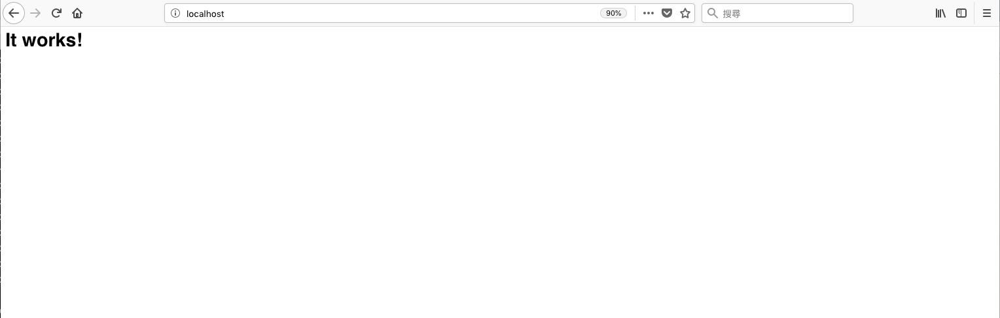

# 在 Mac 上建立自製 Apache 環境

## 筆者心情小語...
當你開心的遛個狗，哼哼小曲沒事想說更新一下心愛的 **MAC** 突然 **Apache** 開發環境就被 **MAC OS** 給狹持了(設定重置)!!

所以說 **Apache** 開發環境必須獨立!

- 特別感謝: 給力小夥伴指導我許多 **LINUX** 與 **APACHE** 相關設定及觀念。


## 為什麼要自製 Apache 環境
**MAC OS** 更新版本有時都會突然的重置原生 **Apache** 設定。

特別是此次 **OS 10.14**，連 **PHP** 外部建置環境都給靜止了!!

若您是使用套件架設環境(**MAMP**、**LAMP**、**XMAPP**等...)，那您可能不會有太大的感悟。

但若是您用的是 **MAC** 提供的原生 **Apache**，那您可能連做個系統小更新都要小心翼翼的。


此處筆者用 **HomeBrew** 進行自製 **Apache** 環境建置。

## 需求
* Mac OS(Linux) 系統電腦一台。
* [HomeBrew](https://brew.sh/index_zh-tw)


## 開始建置吧

1. 關閉 Mac OS 原生的 Apache 並防止他自行啟動


    ```
    // 關閉 apache
    $ sudo apachectl stop
    
    // 靜止 apache httpd 自動啟動
    $ sudo launchctl unload /System/Library/LaunchDaemons/org.apache.httpd.plist 2>/dev/null
    ```

2. 使用 **HomeBrew** 安裝 **apache**

    ```
    $ brew install httpd
    ```

3. 通過指令檢查 **apache** 安裝，路徑應該被更改為 `/usr/local/bin/apachectl`
    ```
    $ which apachectl
    ```
    
4. 確認啟用指令被改寫後，重啟 **apache**
    ```
    $ sudo apachectl -k start
    ```
    
5. 設置預設啟用程序  
    ```
    $ sudo brew services start httpd
    ```
    
6. 設置 **apache** 基礎設定
    * **brew** 建置的 **Apache** 位置為: `/usr/local/etc/httpd`
    * 編輯 `httpd.conf` 修改以下項目:
        * `Listen 80`
        * `ServerName localhost`
        * `	DocumentRoot "/usr/local/var/www"`
        * 開啟 `rewrite_module` (移掉 **#**): `LoadModule rewrite_module lib/httpd/modules/mod_rewrite.so`



至此， **apache** 應已建置完成並啟用。 連結網站吧！



## 後話
若您是剛開始進行網站架設，那後續 `PHP` 安裝可透過 `brew` 安裝。也可透過 Liip 進行後續環境建置。 請繼續往下走。

若您與筆者一樣是遭逢巨變而需要重新建置新環境。那後續設定僅需由 **Mac Apache** 那邊移植設定檔即可(注意設定檔不可直接使用，許多路徑都不同了)。

`Liip` 部分 筆者是自行移植載入檔案(`/etc/apache2/other`)，並於 `httpd.conf` 下自行添加 `Include /usr/local/etc/httpd/other/*.conf`。

## HomeBrew 建置 PHP 環境
待捕

## Liip 建置 PHP 環境
待捕


----

- 小知識:
    * Mac OS 是使用 **plist** 文件設置程序隨機啟動。 **plist** 文件分佈在: `/System/Library/LaunchDaemons/` 中，其中指令 **apache** 及 **httpd** 相關配置文件為 `org.apache.httpd.plist`。
        
    * 使用 `brew` 不需 `root` 身份，若以 `root` 身份執行會被停止且警告。 

    

