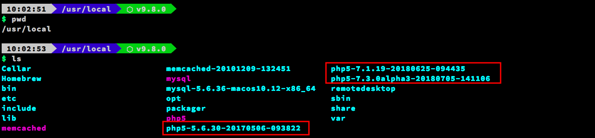
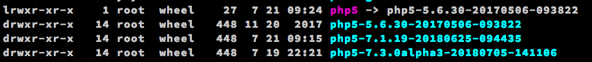
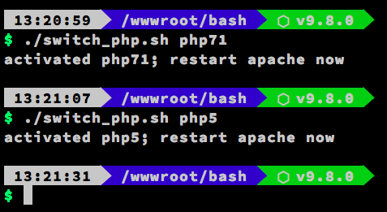

#在 Mac 上切換 PHP 版本

若你和筆者一樣，是使用 [Liip](https://php-osx.liip.ch/) 替你的 Mac 部署 PHP 的話。那麼恭喜你，切換版本將會變得非常簡單


##關於備份
使用 Liip 可以非常簡單快速地切換版本。
但筆者有聽聞其他人在**安裝 Liip PHP 時會覆蓋原 APACHE 設定**(雖然筆者並沒有遇到相關問題)。

所以建議在安裝前先對 `etc/apache2` 底下設定檔進行<font color=red>備份</font>。以便回覆設定檔。

> <font color='#888888'>更好的做法是將客制設定拉出來做獨立檔案，再將設定檔 Include 回對應位置即可。</font>

##PHP版本安裝
只要到 [Liip](https://php-osx.liip.ch/) 挑選對應版本至 CMD 進行指令動作即可。
不需要特別於 root 身份執行。反正會再問你一次密碼。


##版本切換
Liip 會將 PHP 套件安裝於 `/usr/local` 底下，我們可至該目錄查看套件包是否存在。

<font color='#888888'>(紅匡部分為 PHP 不同版本之套件包)</font>


Liip PHP 會指定版本做 **symbolic link** 建立 PHP5 目錄以便做對應版本執行。 
<font color='#888888'>(筆者當下版本為 5.6) </font> 

由此可知，**想要切換 PHP 版本，只要更改 PHP5 目錄 LINK 指向即可**。

### <font color='#888888'> 切換捷徑 </font>
```
cd /usr/local
rm php5
ln -s php5-7.3.0alpha3-20180705-141106 php5
```
> <font color='#888888'>當你使用 Liip 部署好選定版本後，可以透過 [phpinfo](http://php.net/manual/en/function.phpinfo.php) 去確定本機執行當下版本。亦可在 CMD 下 `php -v` 查看。</font>


##快速切換版本
若覺得每次切換版本都需要輸入指令實在太麻煩，可以寫 **Base Shell** 來做快速切換。
建立檔案 switch_php.sh (位置隨意，方便呼叫即可)並填入以下指令。
```
#!/bin/bash

# 使用方式
# ./switch_php.sh <version>
# ./switch_php.sh php5
# ./switch_php.sh php71
# ./switch_php.sh php73

# activate php56
if [ "$1" == "php5" ]; then
   sudo rm /usr/local/php5
   sudo ln -s php5-5.6.30-20170506-093822 /usr/local/php5
   echo "activated php5; restart apache now"
fi

if [ "$1" == "php71" ]; then
   sudo rm /usr/local/php5
   sudo ln -s php5-7.1.19-20180625-094435
   echo "activated php71; restart apache now"
fi

if [ "$1" == "php73" ]; then
   sudo rm /usr/local/php5
   sudo ln -s php5-7.3.0alpha3-20180705-141106 /usr/local/php5
   echo "activated php73; restart apache now"
fi
```
<font color='#888888'>(此處注意 PHP 版本名稱， Liip 建立版本檔案後面名稱會採亂數。故各位裝載後版本名稱可能會與筆者相左) </font>

建立好後只要下相關指令即可快速切換 PHP 版本囉。


><font color='#888888'>注意切換 PHP 版本後要重新啟動 APACHE 服務載入切換後的設定檔。
> `apachectl restart`</font>


####參考連結
* [PHP 5.6 and PHP 7 on same Mac with Liip
](https://blog.joeymasip.com/php-5-6-and-php-7-on-same-mac-with-liip/)

